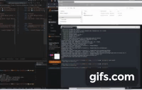

# light-dark-cli-win11

I don't like switching through a couple of windows screens to switch light and dark modes.

This chages the registrey directly to toggle light and dark with each run.

That is all.

# Installing

This only works on Windows 11.  To install

```
winget install light-dark-cli-win11

# next time you log in

light-dark
```

You may create a new shortcut by right clicking on the desktop. Point it at 'light-dark' and you now have an icon you can click to toggle the light and dark mode.

# License

MIT, if you need a license.

## Demo

